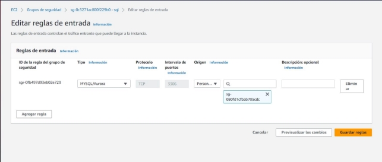
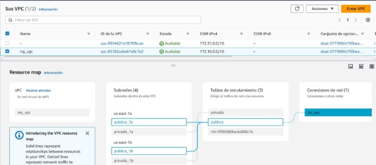
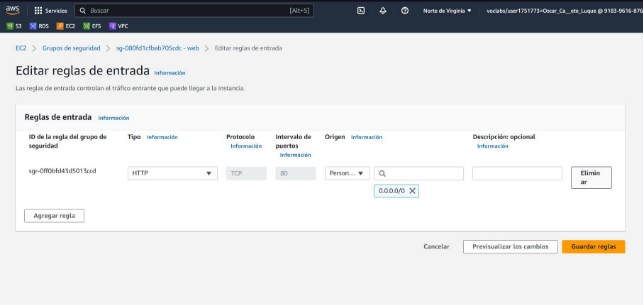
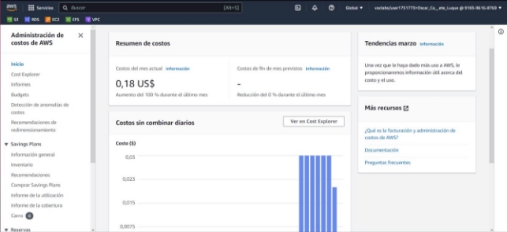

 Ciclo Formativo de Grado Superior de  Administración de Sistemas Informáticos 

**Implantación de Aplicaciones Web      Enrique Guzmán Mesa – 2ºASIR        Proyecto: Proyecto Final (Clothing Corp) Curso 2022/2023** 

**Índice de contenido** 

**1.- Introducción** 

El proyecto trata de una web de una tienda de ropa, esta web tratara de usar servicios en la nube y realizar un seguimiento de los clientes y compras y detectar patrones de datos para que su estrategia de marketing y producción sea eficiente. 

**2.- Objetivos y requisitos del proyecto** 

Tendremos que crear una manera de que saquemos una tabla de datos para que el administrador sacar sus estadísticas, también tendremos que hacer que los clientes tengan que registrarse para comprar productos 

**3.- Estudio previo** 

A raíz de las compras de nuestros clientes tendremos una Base de datos donde podremos ver quien compra y que compra para poder ver lo mas  vendido. 

***3.1.- Estado actual*** 

En este proyecto hemos creado una maquina ec2 y una rds, tendremos una pagina principal que será el home para que los clientes tengan una primera impresión, para que un cliente pueda comprar tiene que registrarse en la pagina, también tenemos que el usuario administrador es el único que puede añadir modificar o eliminar. 

***3.2.- Estudio de soluciones existentes*** 

Realizaremos un despliegue en AWS con diferentes servicios. 

- Crearemos una instancia EC2: En esta instancia tendremos la pagina principal y los formularios de registro y login de los usuarios. 
- Crearemos una instancia RDS: En esta maquina guardaremos los usuarios, las ventas y los productos 

**4.- Plan de trabajo** 

El plan de trabajo es el siguiente: 

Tener un entorno de trabajo configurado y preparado de amazonAWS, tendremos que securizarlo para ello necesitamos la VPC, las subredes y los grupos de seguridad. 

La base de datos (RDS) tendrá que estar en la subred privada con un grupo de seguridad para que solo la web pueda acceder 

**5.- Diseño** 

***5.1.- Diseño general*** 

Vamos a crear una índice que será la portada de nuestra pagina con un login y un registro, los usuarios normales se meterán en una pestaña para poder comprar, los administradores se iran a otra pagina donde podrán agregar quitar y listar el inventario de la empresa 

***5.2.- Diseño detallado*** 

Plantilla index.html con enlace a registro.html y login.html, dependiendo de la opción nos llevara a un sitio a otro, en caso de login tenemos dos opciones dependiendo del usuario, si la base de datos detecta que es un usuario normal, lo llevara a la pestaña compras donde podrá comprar los productos que necesite, en caso de ser administrador lo llevara a una pestaña donde podrá modificar crear y eliminar los productos de la empresa 

**6.- Implantación** 

Hemos creado al principio una VPC con lo siguiente: 2 subredes una privada y una publica, a continuación, hemos creado una EC2 amazon Linux y la hemos insertado en la VPC, dentro de la VPC la hemos colocando en la subred publica por ultimo hemos creado una RDS donde el grupo de seguridad será el suyo (sql) y tendrá permisos de entrada el grupo (web). 

**7.- Recursos** 

Utilizaremos una VPC con subredes, en la subred privada tendremos la RDS y en la publica una EC2 amazon linux 

***7.1.- Herramientas hardware*** 

Utilizaremos lo siguiente: 

1 EC2: 

T2.micro 

En la subred publica Los servicios de AWS. 

***7.2.- Herramientas software*** 

1 RDS + Grupos de seguridad: 

Esta mantenida por Amazon. Subred privada 

VPC:  

EC2: 

***7.3.- Personal*** 

Personal: nosotros mismos 

***7.4.- Presupuesto*** 

Tendremos el presupuesto que amazon nos da que es el siguiente: 100$ y cada mes consumimos lo siguiente: 

**8.- Conclusiones** 

***8.1.- Grado de consecución de objetivos*** 

1 FUNCIONALIDAD ENTRE EC2 Y RDS : CORRECTO 2 FUNCIONALIDAD DE LA PAGINA WEB: CORRECTO 3 VPC: CORRECTO 

4 SECURIZACIÓN: CORRECTO 

5 LOGIN Y REGISTROS: CORRECTO 

***8.2.- Problemas encontrados*** 

El principal problema que hemos encontrado a sido el siguiente: al crear la VPC nos hemos dado cuenta que no podemos acceder externamente con clientesSQL a nuestra base de datos para modificar o crear, lo que hemos hecho para solucionar el problema a sido crear un modelo en local y una vez comprobado que funciona exportar nuestra base de datos y moverla al server. 

***8.3.- Futuras mejoras*** 

Creemos que el diseño de la pagina es mejorable estéticamente hablando 

**9.- Referencias / bibliografía** 

Estas han sido nuestras principales referencias: 

**10.- Anexos** 

Hemos utilizado visual studio y workbench 
